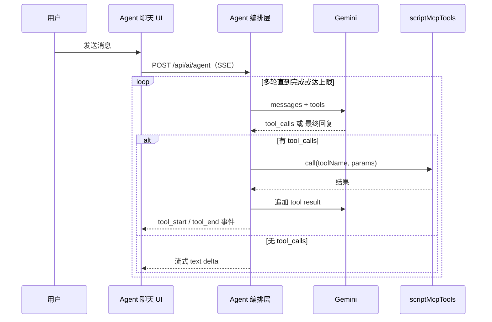

# Agent 聊天框（脚本管理 Agent）— task thread

Status: **TODO**（需求待确认 / 待排期；仅建立任务与方案，**不改代码**）

关联:

- `.cursor/skills/scripts-api-mcp/SKILL.md` — REST / MCP / function calling 契约
- `public/docs/scripts-ai-skill.md` — Agent 系统提示与能力边界
- `public/docs/scripts-function-tools.json` — 工具 JSON Schema
- `services/scripts/scriptMcpTools.ts` — MCP 工具实现
- `app/editor/components/AIPanel.tsx` — 现有单文件 AI 改写（非 Agent）
- `app/editor/components/EditorIntegrationModals.tsx` — MCP / OpenAPI / tools 文档入口
- `extension/TODO.md` · `extension/README.md` — 插件 Admin / Popup 壳

---

## Objective

为 MagickMonkey 增加 **Agent 聊天框**：用户用自然语言管理 Gist 中的用户脚本（查询、创建、修改、删除等），Agent 通过 Web 端已有的 **MCP / REST API** 执行工具调用，交互模式参考 **Codex / Cursor Agent**（多轮 tool loop + 流式回复）。

**本任务用于记录方案与分阶段交付计划**；是否启动实现需产品/技术确认后再排期。

---

## 背景：已有能力 vs 缺口

### 已有

| 能力          | 位置                          | 说明                                                                                            |
| ------------- | ----------------------------- | ----------------------------------------------------------------------------------------------- |
| REST CRUD     | `/api/v1/scripts`             | OpenAPI: `/api/v1/openapi.json`                                                                 |
| HTTP MCP      | `/api/mcp`                    | JSON-RPC `initialize` / `tools/list` / `tools/call`；legacy `{ tool, params }`                  |
| MCP 工具      | `scriptMcpTools.ts`           | `scripts_runtime_summary`、`scripts_list`、`scripts_get`、`scripts_upsert`、`scripts_search` 等 |
| Function 定义 | `scripts-function-tools.json` | 供 LLM function calling 使用的 schema                                                           |
| AI Skill 文档 | `scripts-ai-skill.md`         | 路由、边界、鉴权、推荐编辑流程                                                                  |
| 鉴权          | `integrationAuth.ts`          | Session Cookie（同 `/editor`）或 `x-api-key`（`SCRIPTS_MCP_HEADERS`）                           |
| 编辑器 AI     | `AIPanel.tsx`                 | 单文件 Gemini 改写 + diff 预览；**无** tool loop                                                |
| MCP 安装指引  | `EditorIntegrationModals.tsx` | Cursor / VS Code 一键安装 MCP                                                                   |

### 缺口

| 缺口              | 说明                                               |
| ----------------- | -------------------------------------------------- |
| Agent 编排层      | 无多轮 LLM ↔ tool 循环的服务端实现                 |
| Agent 聊天 UI     | 无独立对话界面（消息流、tool call 卡片、停止生成） |
| 插件内 Agent 入口 | Popup / Admin 仅有「打开编辑器」，无 Agent         |
| 写操作确认 UX     | MCP 可直接写 Gist；UI 层尚无 diff / 二次确认流程   |

---

## 产品定位

### Agent vs 现有 AIPanel

| 维度   | AIPanel（保留）           | Agent 聊天框（新增）                                     |
| ------ | ------------------------- | -------------------------------------------------------- |
| 场景   | 改**当前打开**的单个文件  | **跨文件 / 管理型**对话任务                              |
| 输入   | 针对当前 buffer 的指令    | 自然语言（「列出脚本」「新建 xxx.ts」「搜索并批量改」）  |
| 工具   | 无；直接调 Gemini rewrite | 调用 MCP / REST 工具链                                   |
| 上下文 | 当前文件 + typings        | `scripts-ai-skill` + runtime summary + 可选当前文件 hint |

### 与插件的关系

Extension 产品原则（见 `extension/TODO.md`）：**Web 拥有脚本内容**，Extension 拥有 chrome + 策略。

Agent **不**在插件内重写脚本 API；插件作为 **入口 + 多 Service 上下文**（`baseUrl` / `scriptKey`），实际编排与工具执行在 Web 端完成。

---

## 技术方案

### 1. 总体架构（Codex 式 Agent Loop）

```text
用户 ──► Agent 聊天 UI ──► Agent 编排层（Web Server）──► LLM（Gemini）
                                    │
                                    ▼
                          scriptMcpTools / REST v1
                                    │
                                    ▼
                              GitHub Gist
```



**设计原则**

1. **编排层在 Web 端**（Next.js Route Handler 或 Server Action），与 `rewriteCode` 同级，复用 `withAuthAction` / `authorizeScriptIntegration`。
2. **工具执行不走 LLM**：直接调用 `scriptMcpTools[name].call(params)` 或同源 service 函数，与 `/api/mcp` route 共享逻辑，避免重复实现。
3. **工具定义**：优先静态加载 `scripts-function-tools.json`；可选首轮从 MCP `tools/list` 动态同步。
4. **System Prompt**：注入 `scripts-ai-skill.md` 要点；首轮或按需调用 `scripts_runtime_summary` 约束（@match 确认、不写敏感信息等）。
5. **不新建 MCP Server**：Web `/api/mcp` 已是 HTTP MCP；编排层作为 **MCP Client**（或直接调 service 层）。

### 2. UI 落点（两方案）

#### 方案 A — Web Agent 页 + 插件跳转（推荐 MVP）

| 项       | 说明                                                                                             |
| -------- | ------------------------------------------------------------------------------------------------ |
| 页面     | 新增 `/agent` 或 `/editor/agent`                                                                 |
| 鉴权     | 同 `/editor`，Session Cookie 天然可用                                                            |
| 插件集成 | Popup / Admin 增加「Open Agent」→ `focusOrOpenTab(\`${baseUrl}/agent\`)`（与现有打开编辑器一致） |
| 优点     | 实现最快；无跨域 Cookie / API Key 分发问题；可复用编辑器 Tailwind 主题                           |
| 缺点     | 不在 `extension://` 页面内，需新开 Tab                                                           |

#### 方案 B — 插件内嵌 Agent 面板

| 项   | 说明                                                                                                                                                         |
| ---- | ------------------------------------------------------------------------------------------------------------------------------------------------------------ |
| 页面 | `admin.html#agent` 新 Tab，或右侧抽屉                                                                                                                        |
| 鉴权 | `extension://` 无法带 Web Session，二选一：<br>① iframe 嵌入 `${baseUrl}/agent`（同源 Cookie）<br>② Servers 配置 API Key，background `fetch` 代理 `/api/mcp` |
| 优点 | 体验更一体化                                                                                                                                                 |
| 缺点 | iframe 需处理 CSP / 尺寸；API Key 方案有密钥存储与轮换成本                                                                                                   |

**建议路径**：先做 **方案 A** 验证 Agent Loop；稳定后再做 **方案 B 的 iframe 嵌入**（比裸 API Key 更安全）。

### 3. Agent 聊天 UI 交互（参考 Codex）

```text
┌─────────────────────────────────────────┐
│  Agent                          [服务▼] │  ← 多 Service 时选择 baseUrl（插件跳转可带 query）
├─────────────────────────────────────────┤
│  🤖 已读取 3 个脚本…                     │
│  ┌─ tools/call: scripts_get ─────────┐  │
│  │ foo.ts (1.2KB) ✓                  │  │  ← 可折叠 tool call 卡片
│  └───────────────────────────────────┘  │
│  我帮你更新了 @match…                    │
├─────────────────────────────────────────┤
│  [输入框]                    [发送] [停止] │
└─────────────────────────────────────────┘
```

- **流式输出**：assistant 文本 + tool call 状态（pending / success / error）。
- **写操作确认**（可选开关）：`scripts_upsert` / `scripts_delete` 等弹出「待确认 diff」再执行（可参考 `AIPanel` diff 预览）。
- **上下文**：可选附带「当前编辑器打开的文件」作为 hint（若在 `/editor` 内嵌 Agent 面板）。
- **停止生成**：`AbortController` 中断 SSE。

### 4. 后端模块（概念）

| 模块         | 职责                                               | 建议路径                         |
| ------------ | -------------------------------------------------- | -------------------------------- |
| Agent Route  | 接收 `{ messages, context? }`，SSE 返回事件流      | `app/api/ai/agent/route.ts`      |
| Agent Runner | 多轮循环（上限如 10 轮），Gemini function calling  | `services/ai/agentRunner.ts`     |
| Tool Bridge  | `toolName + params` → `scriptMcpTools`             | `services/ai/agentToolBridge.ts` |
| 会话存储     | MVP：前端 `sessionStorage`；后续：服务端 thread id | —                                |

**SSE 事件类型（建议）**

| type         | payload 示例                         |
| ------------ | ------------------------------------ |
| `text_delta` | `{ delta: string }`                  |
| `tool_start` | `{ id, name, params }`               |
| `tool_end`   | `{ id, name, ok, summary?, error? }` |
| `done`       | `{ finishReason }`                   |
| `error`      | `{ message }`                        |

**环境变量**

- 复用现有 `GEMINI_API_KEY`（与 `AIPanel` 一致）。
- 不在客户端 bundle 暴露 LLM Key 或 `SCRIPTS_MCP_HEADERS`。

### 5. 鉴权与安全

| 项                            | 策略                                                                                  |
| ----------------------------- | ------------------------------------------------------------------------------------- |
| Agent API                     | 与 MCP / REST 同级：`authorizeScriptIntegration`（Session 或 `x-api-key`）            |
| LLM Key                       | 仅服务端；Agent Route 必须登录 Session（MVP 不建议对 Agent 开放纯 API Key 匿名访问）  |
| 写操作                        | 遵循 `scripts-ai-skill.md`：@match / @grant / @run-at 等关键字段需 Agent 提示用户确认 |
| UI 二次确认                   | delete / upsert / batch_patch 可选「预览 diff → 确认执行」                            |
| 插件 API Key（方案 B 裸 Key） | 仅存 `chrome.storage.local`；与 `SCRIPTS_MCP_HEADERS` 轮换联动；**非 MVP 首选**       |
| 操作范围                      | 仅 Gist 内可编辑 `.ts/.js`；不碰 preset、launcher、rules JSON（与 MCP 边界一致）      |

### 6. 与现有组件关系

```text
现有                          新增 / 扩展
────────────────────────────────────────────────────
AIPanel                    →  保留；Agent 负责管理型任务
EditorIntegrationModals    →  增加「在页面内使用 Agent」入口
scriptMcpTools             →  复用，不 fork
extension admin / popup    →  增加 Agent 入口（跳转或 iframe）
```

---

## 分阶段交付

### Phase P0 — 只读 Agent（Web）

- [ ] **P0.1** 新增 Agent 编排层 + `POST /api/ai/agent`（SSE）
- [ ] **P0.2** 接入 Gemini function calling + `scripts-function-tools.json`
- [ ] **P0.3** Tool Bridge 调用 `scriptMcpTools`（只读工具白名单：`scripts_runtime_summary`、`scripts_list`、`scripts_get`、`scripts_search`、`scripts_find`、`scripts_snippet`）
- [ ] **P0.4** Web Agent 页 UI：消息列表、流式文本、tool call 卡片、停止按钮
- [ ] **P0.5** System prompt 加载 `scripts-ai-skill.md` 摘要

**P0 验收**

- [ ] 登录后可对话：「列出所有脚本」「读取 foo.ts」「搜索某关键字」
- [ ] Tool 调用可见、可折叠；错误有明确展示
- [ ] 无写工具被调用

### Phase P1 — 写入 + 确认（Web）

- [ ] **P1.1** 开放写工具：`scripts_upsert`、`scripts_patch`、`scripts_replace`、`scripts_delete`、`scripts_rename`、`scripts_batch_patch` 等（按 MCP 全集或子集）
- [ ] **P1.2** 写操作 diff 预览 + 用户确认（可配置「自动执行只读 / 写入需确认」）
- [ ] **P1.3** 与 `scripts_validate`、index 重建类工具联动
- [ ] **P1.4** 单元测试：Tool Bridge、Runner 循环上限、鉴权失败

**P1 验收**

- [ ] 对话创建 / 修改 / 删除脚本，Gist 实际变更正确
- [ ] 删除与 broad @match 类操作有确认拦截
- [ ] Agent 遵循 skill 文档中的边界提示

### Phase P2 — 插件入口（跳转）

- [ ] **P2.1** Popup 菜单项「Open Agent」
- [ ] **P2.2** Admin header / tab 或 Scripts 页快捷入口
- [ ] **P2.3** 跳转 URL 携带当前 active Service 的 `baseUrl`（query 或 hash），Agent 页展示当前服务上下文
- [ ] **P2.4** 文档：`extension/README.md` + 本 task 状态更新

**P2 验收**

- [ ] 从插件一键打开 Web Agent，且显示正确 server 标签
- [ ] 未配置 Service 时有友好空态

### Phase P3 — 插件内嵌（可选）

- [ ] **P3.1** 方案选型确认：iframe vs background 代理
- [ ] **P3.2** `admin.html#agent` Tab 或侧栏
- [ ] **P3.3** iframe：`${baseUrl}/agent?embed=1` + 样式适配
- [ ] **P3.4** 若 background 代理：message 协议、API Key 配置 UI、错误处理

**P3 验收**

- [ ] 不离开 Admin 页即可完成只读 + 写入对话（与 P1 能力一致）
- [ ] 无 API Key 泄露到 content script / 页面 DOM

---

## 待确认项（启动前需拍板）

| #   | 问题            | 选项                                                     |
| --- | --------------- | -------------------------------------------------------- |
| D1  | Agent 页路由    | `/agent` 独立页 vs `/editor/agent` 子路由                |
| D2  | MVP UI 落点     | 方案 A only vs A+B 并行                                  |
| D3  | 写操作默认策略  | 全部需确认 vs 小 patch 自动、delete 需确认               |
| D4  | 会话持久化      | 仅前端 session vs 服务端 thread（含历史）                |
| D5  | 多 Service      | Agent 是否绑定单一 `baseUrl`（一部署一 Gist）vs 切换服务 |
| D6  | LLM 模型        | 复用现有 Gemini 配置 vs 可配置 provider                  |
| D7  | 与 AIPanel 整合 | 长期是否合并为 Editor 右侧面板「Agent」tab               |

---

## 非目标（Out of scope）

- 在 Extension 内直接编辑 Gist（仍由 Web API 执行）
- 替代 Cursor / 外部 MCP 客户端（外部集成继续用 `/api/mcp`）
- 管理 preset / launcher / rules JSON / 项目源码
- 面向终端用户的「安装脚本」对话（应返回 launcher URL，见 skill 文档）
- 在插件 content script 或页面 world 内运行 Agent

---

## 风险与依赖

| 风险                                       | 缓解                                                                        |
| ------------------------------------------ | --------------------------------------------------------------------------- |
| LLM 误删 / 误写脚本                        | 写确认 + skill 边界 + 可选只读模式                                          |
| Token 消耗（大文件 get）                   | 优先 `scripts_search` / `scripts_snippet`；Runner 内 enforce skill 推荐流程 |
| Gemini function calling 与 MCP schema 差异 | Tool Bridge 做参数校验；以 `scriptMcpTools` validate 为准                   |
| iframe 跨域 / CSP                          | P3 单独评估；MVP 用方案 A 规避                                              |
| 与外部 MCP 客户端行为不一致                | 共用 `scriptMcpTools`，单点维护                                             |

**依赖**

- `GEMINI_API_KEY` 已配置（可选功能；未配置时 Agent 页应明确提示）
- 管理员 Session 或后续 API Key 代理方案

---

## 参考

- Codex / Cursor Agent：聊天 UI + 服务端 tool loop + 流式事件
- 项目 MCP 文档：`public/docs/scripts-ai-skill.md`
- OpenAPI：`GET /api/v1/openapi.json`
- 编辑器集成弹窗：`EditorIntegrationModals.tsx`

---

## 变更记录

| 日期       | 说明                                    |
| ---------- | --------------------------------------- |
| 2026-06-24 | 初稿：方案与分阶段 TODO，待确认是否实施 |
