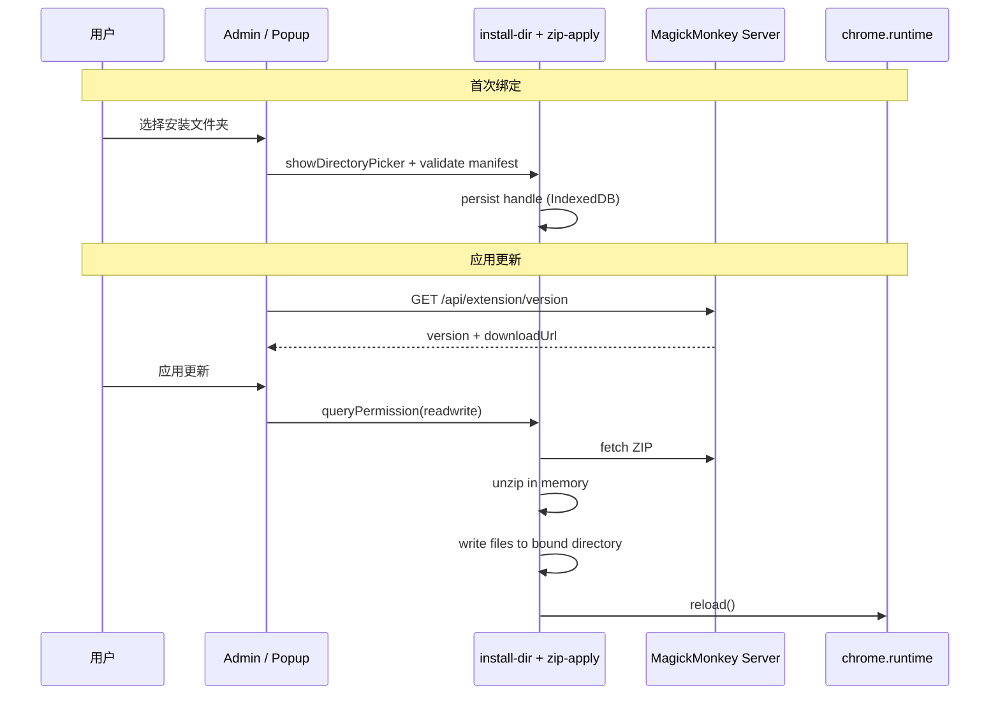

# Extension 本地 ZIP 自更新（File System Access）— task thread

Status: **TODO**（方案已定，**实现未启动**）

**实施记录（2026-06-27 同步）**：仅有版本检测与手动下载（`extension-update-check.ts`、`GET /api/extension/version`、Popup 打开 `downloadUrl`）。**无** `extension-fs-update/` 模块、`fflate`、`showDirectoryPicker` 绑定目录、一键写盘更新。

关联:

- `extension/src/shared/extension-update-check.ts` — 版本检测（已有）
- `app/api/extension/version/route.ts` — 服务端 semver + ZIP URL（已有）
- `extension/src/ui/popup/mm-popup-app.ts` — Popup 更新提示 + `chrome.runtime.reload()`（已有）
- `extension/scripts/pack-extension-zip.mjs` — ZIP 打包产物
- `shared/chrome-extension-download.ts` — 公共下载路径
- `.ai/specs/extension-shell.yaml` — 实现后需登记新模块

---

## Objective

在**不上架 Chrome Web Store**、继续通过 **ZIP + Load unpacked** 分发的场景下，让用户在 Admin **一次性绑定**扩展解压目录后，后续更新只需：

1. 扩展检测到服务端有新版本；
2. 用户点击「应用更新」（或等价入口）；
3. 扩展在**内存中下载并解压 ZIP**，写入已授权目录；
4. 调用 `chrome.runtime.reload()` 加载新壳。

若目录写权限失效，用户**重新选择同一文件夹**即可恢复快速更新，无需手动解压覆盖。

**成功标准：**

- 绑定目录后，从「发现新版本」到「扩展 reload 完成」≤ 3 次用户点击（理想：1 次「应用更新」）。
- `chrome.storage.local` 中的 Servers / Scripts / Permissions 等配置在更新后保留。
- 写盘失败时不破坏现有安装（可继续用旧版本运行）。

---

## 背景：已有能力 vs 缺口

### 已有

| 能力        | 位置                                                 | 说明                                                               |
| ----------- | ---------------------------------------------------- | ------------------------------------------------------------------ |
| 版本 API    | `GET /api/extension/version`                         | 返回 `{ version, downloadUrl }`                                    |
| 客户端比对  | `fetchExtensionUpdateInfo()`                         | semver 比较 `updateAvailable`                                      |
| Popup 提示  | `mm-popup-app.ts`                                    | 有新版本时显示下载按钮（当前仅 `chrome.tabs.create(downloadUrl)`） |
| 手动 reload | Popup / dev SSE                                      | `chrome.runtime.reload()` 已可用                                   |
| ZIP 产物    | `public/downloads/magickmonkey-chrome-extension.zip` | `pnpm pack:extension` 生成                                         |

### 缺口

| 缺口         | 说明                                     |
| ------------ | ---------------------------------------- |
| 目录绑定     | 无 File System Access 目录句柄持久化     |
| 内存解压写盘 | 无 ZIP fetch → unzip → write 管线        |
| 一键应用更新 | Popup 仅打开下载页，无覆盖 + reload 闭环 |
| 权限恢复 UX  | 句柄过期时无引导「重新选择文件夹」       |

---

## 约束与可行性结论

### Chrome 平台限制（不可突破）

| 项                           | 结论                                                                   |
| ---------------------------- | ---------------------------------------------------------------------- |
| 扩展获知磁盘绝对路径         | ❌ 无 API                                                              |
| Background SW 弹出目录选择器 | ❌ 需扩展页 + 用户手势                                                 |
| 扩展静默写任意路径           | ❌ 必须 File System Access 授权                                        |
| 覆盖已解压目录后 reload      | ✅ `chrome.runtime.reload()` 读取磁盘新文件                            |
| 仅适用于 Load unpacked       | ✅ `installType === 'development'`（见 `chrome.management.getSelf()`） |

### 方案选型确认

采用 **File System Access API（方案 A）**，不引入 Native Messaging 或企业策略 CRX。

**浏览器支持：** Chromium 86+（Chrome / Edge）；仅 extension page（`admin.html`、必要时 `popup.html`）可调用 `showDirectoryPicker`。

**依赖：** 新增轻量解压库（推荐 `fflate`，纯 JS、体积小，适合 MV3 bundle）。

---

## 用户流程

### 首次绑定（Admin → Settings / Extension）

```text
用户 Load unpacked 安装
    → 打开 Admin（extension options）
    → 「扩展更新」区块 → 「选择安装文件夹」
    → showDirectoryPicker({ mode: 'readwrite' })
    → 校验目录含 manifest.json 且 name === 'MagickMonkey'
    → 持久化 FileSystemDirectoryHandle → IndexedDB
    → 显示「已绑定 · 当前 vX.Y.Z」
```

### 日常更新（Popup 或 Admin）

```text
Popup/Admin 发现 updateAvailable
    → 用户点击「应用更新 vX.Y.Z」
    → （若需要）queryPermission → 不足则提示重新选择文件夹
    → fetch(downloadUrl) → ArrayBuffer
    → fflate 解压到内存文件表
    → 按相对路径写入绑定目录（跳过 __MACOSX/、.DS_Store）
    → 校验 manifest.json 可读且 version 匹配目标
    → chrome.runtime.reload()
```

### 权限失效恢复

```text
queryPermission === 'prompt' 或 IndexedDB 句柄丢失
    → UI：「需要重新授权安装文件夹」
    → 用户再次 showDirectoryPicker（选同一文件夹）
    → 继续应用更新
```

---

## 技术架构

```text
┌─────────────────────────────────────────────────────────────┐
│  Popup / Admin UI                                           │
│  - 显示 updateAvailable / 绑定状态                           │
│  - 用户手势：绑定目录 / 应用更新                              │
└───────────────────────────┬─────────────────────────────────┘
                            │
                            ▼
┌─────────────────────────────────────────────────────────────┐
│  extension-fs-update/（新模块，Admin 页运行为主）             │
│  ├── install-dir-bind.ts      目录选择 + 校验 + 句柄持久化    │
│  ├── install-dir-store.ts     IndexedDB 读写 handle          │
│  ├── zip-apply-update.ts      fetch → unzip → write          │
│  └── update-progress.ts       阶段状态（供 UI 展示）            │
└───────────────────────────┬─────────────────────────────────┘
                            │ 复用
                            ▼
┌─────────────────────────────────────────────────────────────┐
│  extension-update-check.ts（已有）                            │
│  GET /api/extension/version                                   │
└─────────────────────────────────────────────────────────────┘
```



---

## 模块设计

### 1. 目录绑定 `install-dir-bind.ts`

| 职责                               | 说明                                                                                      |
| ---------------------------------- | ----------------------------------------------------------------------------------------- |
| `pickInstallDirectory()`           | `showDirectoryPicker({ mode: 'readwrite' })`，需用户手势                                  |
| `validateInstallDirectory(handle)` | 读取根 `manifest.json`；校验 `name === 'MagickMonkey'`；可选校验 `manifest_version === 3` |
| `getBoundInstallDirectory()`       | 从 IndexedDB 恢复句柄；`queryPermission`；返回 `granted` / `prompt` / `denied`            |

**不校验** `chrome.runtime.id` 与目录内 `key` 字段一致性（unpacked 包可能无 `key`）；以 **name + 用户显式绑定** 为准，避免误绑时 UI 明确展示路径句柄的「显示名」（`handle.name`，仅为文件夹名而非绝对路径）。

### 2. 句柄持久化 `install-dir-store.ts`

| 项             | 值                                        |
| -------------- | ----------------------------------------- |
| IndexedDB 库名 | `vws_extension_fs`                        |
| Store          | `install_dir_handles`                     |
| Key            | `'magickmonkey_install'`                  |
| 存储值         | `FileSystemDirectoryHandle`（结构化克隆） |

附带 metadata（同一 record 或 `chrome.storage.local`）：

| Key                                  | 用途                                          |
| ------------------------------------ | --------------------------------------------- |
| `vws_extension_install_dir_name`     | 上次绑定文件夹名（`handle.name`，供 UI 展示） |
| `vws_extension_install_dir_bound_at` | ISO 时间戳                                    |
| `vws_extension_last_applied_version` | 上次成功写盘的版本                            |

### 3. ZIP 应用 `zip-apply-update.ts`

**输入：** `downloadUrl: string`, `expectedVersion: string`, `directoryHandle: FileSystemDirectoryHandle`

**步骤：**

1. `fetch(downloadUrl, { cache: 'no-store' })` → `ArrayBuffer`
2. `fflate.unzipSync` / async 变体 → `Record<string, Uint8Array>`
3. 过滤条目：
   - 跳过 `__MACOSX/`、以 `.` 开头的 junk、`*.DS_Store`
   - 只保留 ZIP 内相对路径（pack 脚本在 `extension/dist` 根目录打包，条目应为 `manifest.json`, `background.js`, …）
4. **写盘顺序：**
   - 先写非 `manifest.json` 文件
   - 最后写 `manifest.json`（作为「提交点」）
5. 写单个文件：`getFileHandle(path, { create: true })` → `createWritable()` → `write` → `close`
6. 子目录：`getDirectoryHandle(part, { create: true })` 递归
7. 返回 `{ appliedVersion, fileCount, bytesWritten }`

**失败策略：**

- 任一步失败 → 中止后续写入，UI 展示错误；**不**自动 delete 旧文件（旧版仍可 reload 使用）
- 可选增强（Phase 2）：写入前在目录内建 `.vws-update-staging/`，全部写完后 rename 交换；降低半写状态风险

### 4. 与 Background 的边界

| 操作                      | 运行上下文                                                 |
| ------------------------- | ---------------------------------------------------------- |
| 版本检测                  | 可在 Background（已有 `buildStatus`）或 Admin 页直接 fetch |
| 目录选择 / 写盘           | **仅** Admin 页（推荐）或 Popup（空间紧，作快捷入口）      |
| `chrome.runtime.reload()` | Admin / Popup 均可调用                                     |

**不建议**在 Background SW 内写盘：无 File System Access，且无用户手势恢复权限。

可选 Shell 消息（若 Popup 需触发 Admin 应用更新）：

| Message                       | 用途                                      |
| ----------------------------- | ----------------------------------------- |
| `EXTENSION_UPDATE_GET_STATUS` | 绑定状态 + `updateAvailable` + 权限状态   |
| `EXTENSION_UPDATE_OPEN_ADMIN` | 打开 `admin.html#settings` 并聚焦更新区块 |

实现期可简化为：Popup 仅 `chrome.tabs.create({ url: getURL('admin.html#settings') })`，Admin 承载全部写盘逻辑。

---

## UI 规格

### Admin — Settings（或新 hash `#settings` / Servers 页底部区块）

| 元素               | 行为                                             |
| ------------------ | ------------------------------------------------ |
| 绑定状态           | 「未绑定」/「已绑定：{folderName}」              |
| 「选择安装文件夹」 | 首次绑定或重新授权                               |
| 「清除绑定」       | 删除 IndexedDB 句柄 + metadata（不删磁盘文件）   |
| 版本行             | 已安装 `vA` · 服务端 `vB`（有更新时高亮）        |
| 「应用更新」       | 有更新 + 已授权时可点；进行中 disable + 进度文案 |
| 错误区             | 网络失败 / 校验失败 / 权限被拒                   |

### Popup（保持紧凑）

| 变更             | 说明                                                               |
| ---------------- | ------------------------------------------------------------------ |
| 现有「下载」按钮 | 改为「更新」：已绑定 → 打开 Admin 更新区或内联 confirm 后 delegate |
| 未绑定           | 文案「在设置中绑定安装文件夹后可一键更新」+ 链接 Admin             |
| Footer 版本      | 保持；有更新时 badge 或 title 提示                                 |

### 安装类型提示

通过 `chrome.management.getSelf()`（需 manifest 增加 `"management"` permission）：

- `installType !== 'development'` 时隐藏「绑定文件夹」功能，保留现有「打开下载页」行为（为将来商店版预留）。

---

## Manifest 变更（实现期）

```json
{
  "permissions": ["management"]
}
```

`management` 仅用于 `getSelf().installType` 判断是否为 unpacked 本地安装；不枚举其他扩展。

---

## 安全与信任

| 风险              | 缓解                                                                                   |
| ----------------- | -------------------------------------------------------------------------------------- |
| 用户误选其他目录  | 绑定前强制读 `manifest.json` 校验 `name`                                               |
| 中间人替换 ZIP    | HTTPS + 仅信任已配置 `baseUrl` 的 `downloadUrl`；可选 Phase 2：SHA256 加入 version API |
| 恶意 ZIP 路径穿越 | 拒绝含 `..`、绝对路径 `\`、`:` 的条目                                                  |
| 写权限过大        | 仅用户选择的单一目录；UI 明确说明用途                                                  |
| 更新中途扩展损坏  | 最后写 `manifest.json`；Phase 2 staging 目录                                           |

---

## 实现阶段

### Phase 1 — 核心闭环（MVP）

- [ ] 添加 `fflate` 依赖；`extension/src/shell/extension-fs-update/` 模块
- [ ] IndexedDB 句柄存储 + manifest 校验
- [ ] Admin Settings UI：绑定 / 应用更新 / 错误展示
- [ ] 接入 `fetchExtensionUpdateInfo` + reload
- [ ] `installType === 'development'` 门控
- [ ] reload 前/后 Admin 路由捕获与恢复（抽离自 `dev-admin-restore` 或通用化）
- [ ] 单元测试：`zip` 路径过滤、manifest 校验逻辑（Node 侧 mock handle 或抽纯函数）

### Phase 2 — 体验加固

- [ ] `.vws-update-staging/` 原子切换
- [ ] Popup 快捷「应用更新」（已绑定且权限 granted 时）
- [ ] `captureAdminPageForDevReload` 同类逻辑：更新前保存 Admin 路由 hash（复用 `dev-admin-restore` 思路）
- [ ] version API 可选 `sha256` 字段校验

### Phase 3 — 文档与规格同步

- [ ] `extension/README.md` — 安装 / 更新章节
- [ ] `.ai/specs/extension-shell.yaml` — 登记 `extension-fs-update` 模块
- [ ] `extension/TODO.md` — 关闭「OTA via popup Update (no CRX rebuild)」相关项

---

## 验证清单

- [ ] 全新安装：Load unpacked → 绑定 `extension/dist` → 应用同版本 ZIP → reload 成功、配置保留
- [ ] 跨版本：服务端版本更高 → 应用更新 → `chrome.runtime.getManifest().version` 更新
- [ ] 权限 `prompt`：清除站点权限后 → UI 引导重新选择 → 更新成功
- [ ] 误绑目录（无 manifest / 错误 name）→ 绑定被拒绝
- [ ] 网络失败 / 损坏 ZIP → 旧版仍可 reload 运行
- [ ] 非 development 安装（若可测）→ 不显示绑定 UI
- [ ] Jest：路径净化、semver 与写盘顺序逻辑

---

## 非目标

- 上架 Chrome Web Store 后的 `update_url` 自动更新（将来另做）
- Native Messaging 安装器
- 自动静默更新（无用户点击）—— Chrome 不允许
- 替用户完成「Load unpacked」首次安装（仍需手动加载解压目录）

---

## 开放问题（实现前确认）

| #   | 问题                                  | 建议默认                                                                                       |
| --- | ------------------------------------- | ---------------------------------------------------------------------------------------------- |
| 1   | Admin 设置入口放在哪个 hash？         | 新增 `#settings` 或在 Servers 页底部「Extension update」区块                                   |
| 2   | Popup 是否在 Phase 1 做「一键应用」？ | Phase 1 仅跳转 Admin；Phase 2 再快捷应用                                                       |
| 3   | version API 是否增加 `sha256`？       | Phase 2；MVP 信任 HTTPS                                                                        |
| 4   | ZIP 内是否包含根目录前缀？            | 以当前 `pack-extension-zip.mjs` 在 `dist/` 内 `zip .` 为准（无额外前缀）；实现时用集成测试锁死 |

---

## 方案审查补遗（2025-06 review）

以下为初版方案对照代码库审查后补充的缺漏与实现约束，实现时应纳入 Phase 1 设计。

### 1. 多 Service 下「以谁为准」

当前 `fetchExtensionUpdateInfo` 走 `loadExtensionConfig()` → **第一个 enabled scriptKey 的 OTA 代表** `baseUrl`（见 `legacy-config.ts`）。

| 补遗               | 说明                                                                                                         |
| ------------------ | ------------------------------------------------------------------------------------------------------------ |
| UI 明示来源        | Admin 更新区展示「检查自：{serverLabel / baseUrl}」                                                          |
| `downloadUrl` 校验 | 响应中的 `downloadUrl` origin 必须落在**某一 enabled Service 的 baseUrl origin** 内；禁止盲目 fetch 任意 URL |
| 多部署版本不一致   | 不同服务器可能部署不同 extension 版本；MVP 沿用 OTA 代表；Phase 2 可选「选择检查来源 Service」               |

### 2. `networkEnabled` 门控

`buildStatus` 仅在 `networkEnabled && baseUrl` 时检查更新（`background.ts`）。

| 补遗        | 说明                                               |
| ----------- | -------------------------------------------------- |
| 应用更新    | 同样需要网络开启；关闭网络时禁用「应用更新」并提示 |
| 与 OTA 一致 | 扩展壳更新不应绕过 Shell network 开关              |

### 3. 权限 API 细节

方案写了 `queryPermission`，实现还需：

| 步骤            | API                                                                         |
| --------------- | --------------------------------------------------------------------------- |
| 恢复句柄后      | `queryPermission({ mode: 'readwrite' })`                                    |
| 结果为 `prompt` | 在用户点击「应用更新」手势内调用 `requestPermission({ mode: 'readwrite' })` |
| 结果为 `denied` | 引导「重新选择安装文件夹」                                                  |

持久化句柄在浏览器重启后常见 `prompt`，**不能假设** IndexedDB 恢复即 granted。

### 4. 旧文件残留（orphan files）

当前写盘策略为**覆盖/新增**，不删除 ZIP 中已移除的旧文件。

| 风险 | 示例：旧版 `foo.js` 在新版已删除，磁盘仍保留，极端情况下可能被错误加载 |
| 补遗 | Phase 1 文档化此限制；Phase 2 staging 方案中：**staging 完整写入后**，删除绑定目录内非 staging 且不在新文件清单中的扩展文件（排除用户数据如 `.vws-*` 若存在）；或 MVP 接受残留，依赖 reload 只加载 manifest 所列入口 |

### 5. 主线程阻塞与进度

`fflate.unzipSync` 会阻塞 Admin 页 UI。

| 补遗 | 使用 `unzip` 异步 API；写盘分批 `await` 并让出主线程；按钮态 `applying` + 阶段文案（下载中 / 解压中 / 写入中 / 校验中） |
| 互斥 | 应用更新过程加 mutex，防止连点导致并发写盘 |

### 6. `reload` 后 Admin 路由恢复

`dev-admin-restore.ts` 仅在 dev watch 构建生效。

| 补遗 | FS 更新触发的 `chrome.runtime.reload()` 应**复用同一套路**（或抽成通用的 `captureAdminPageBeforeReload`），生产环境更新后回到 `#settings` / 原 Admin hash，避免用户丢失上下文。建议纳入 **Phase 1**（成本低、体验影响大）。 |

### 7. 模块放置路径

写盘逻辑运行在 **Admin 页**，非 Background SW。

| 建议路径 | `extension/src/ui/admin/extension-update/` 或 `extension/src/shared/extension-fs-update/` |
| 避免 | 放在 `shell/` 易误导为 SW 职责 |

### 8. `installType` 边界

| 类型          | 行为                                            |
| ------------- | ----------------------------------------------- |
| `development` | Load unpacked（本方案目标）                     |
| `sideload`    | 本地 CRX 侧载；**不**走 FS 绑定，保留打开下载页 |
| `normal`      | 商店安装；同上                                  |

### 9. 同版本重应用

| 补遗 | 可选支持「重新应用当前版本」（修复半写损坏）；不依赖 `updateAvailable`，但需确认对话框 |

### 10. 验证清单补充

- [ ] `networkEnabled === false` 时「应用更新」不可用
- [ ] `downloadUrl` 为第三方 origin 时被拒绝
- [ ] 浏览器重启后首次应用更新：`requestPermission` 流程正常
- [ ] reload 后 Admin 回到更新前 hash
- [ ] 并发双击「应用更新」仅执行一次

---

## 参考

- [File System Access API](https://developer.chrome.com/docs/capabilities/web-apis/file-system-access)
- [Persist permissions](https://developer.chrome.com/docs/capabilities/web-apis/file-system-access#persist-permissions)
- 现有更新检测：`extension/src/shared/extension-update-check.ts`
- 打包脚本：`extension/scripts/pack-extension-zip.mjs`
