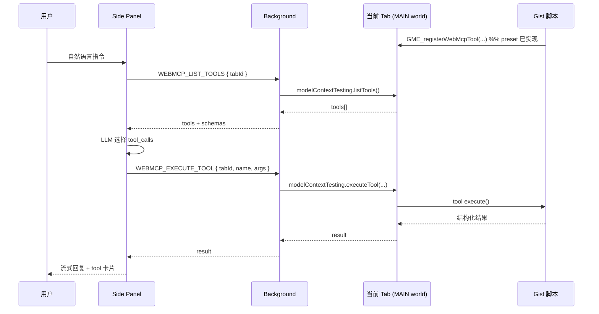

# 扩展 WebMCP Agent 侧栏 — 需求文档

Status: **TODO**（需求待确认 / 待排期；**不改代码**）

关联:

- [Chrome WebMCP 文档](https://developer.chrome.com/docs/ai/webmcp)
- [WebMCP vs HTTP MCP](https://developer.chrome.com/docs/ai/webmcp/compare-mcp)
- [Model Context Tool Inspector](https://chromewebstore.google.com/detail/webmcp-inspector/ddmnodehiebeklbngpeeghmcohomfimd) — 交互参考（侧栏 + Agent + 工具执行）
- `extension/README.md` · `extension/TODO.md` — 扩展壳产品定位
- `extension/docs/multi-service-tasks.md` — 多 Service / scriptKey / Connect
- `.ai/tasks/backlog/preset-gme-webmcp.md` — **独立**：preset `GME_registerWebMcpTool`（脚本注册工具；本任务只**调用**）
- `.ai/tasks/backlog/agent-chat-panel.md` — **Web 端** Gist 管理 Agent（HTTP MCP，互补）
- `.ai/tasks/backlog/editor-webmcp.md` — **编辑器页面** `editor_*` WebMCP（独立需求，非本任务主路径）
- `.cursor/skills/scripts-api-mcp/SKILL.md` — HTTP MCP / REST（远程改 Gist，非页面控制）

---

## 1. 背景与问题

### 1.1 现状

MagickMonkey **Chrome 扩展**已是用户脚本的原生加载壳：background 拉 OTA、content bridge 注入 preset + Gist 模块，在匹配的网页上执行 DOM 增强（菜单、通知、站点逻辑等）。

用户脚本通过 `GM_*` / `GME_*` 直接操作页面，但存在缺口：

| 能力                | 现状                                                                                                                | 缺口                                                             |
| ------------------- | ------------------------------------------------------------------------------------------------------------------- | ---------------------------------------------------------------- |
| 自然语言控制当前页  | 无                                                                                                                  | 用户只能说「帮我屏蔽弹幕」，脚本不会自动理解                     |
| 结构化页面操作      | 脚本内硬编码逻辑                                                                                                    | Agent 无法发现「当前页有哪些可调用的动词」                       |
| 跨站点个人偏好      | `GM_setValue` 分散在各脚本                                                                                          | 无统一的「我的设定」层供 AI 读取                                 |
| 页面工具发现 / 调试 | 无                                                                                                                  | 需类似 WebMCP Inspector 的能力，但应**内置在 MagickMonkey 扩展** |
| WebMCP              | 编辑器侧实验性注册（`initializer/webmcp`）；**Gist 脚本 `GME_registerWebMcpTool` 已实现**（`preset-gme-webmcp.md`） | 扩展壳 **Side Panel Agent** 代理调用（backlog）                  |

**HTTP MCP**（`/api/mcp`）解决的是 **Gist 仓库远程 CRUD**，无法代表用户操作**眼前打开的 Tab**（播放器、弹幕层、全屏状态等）。

### 1.2 WebMCP 在本需求中的角色

**WebMCP** 是浏览器 Tab 内的工具注册协议（`document.modelContext.registerTool`）。本需求将其作为 **页面控制的结构化接口**：

- **谁注册工具**：用户 Gist 脚本经 **`GME_registerWebMcpTool`**（preset **已实现**，见 `preset-gme-webmcp.md`）、少数自带 WebMCP 的站点（未来）、扩展可选的通用只读工具（次路径）
- **谁调用工具**：扩展 **Side Panel Agent**（经 background 代理 `navigator.modelContextTesting`）
- **谁实现 DOM**：仍由**脚本**在 `execute()` 内完成；Agent **不**以 scrape DOM 为主路径

```text
用户自然语言 + 站点偏好
        ↓
扩展 Side Panel Agent（LLM tool loop）
        ↓
Background WebMCP 代理 → 当前 Tab
        ↓
页面已注册的 WebMCP 工具（多来自 Gist 脚本）
        ↓
DOM / 播放器 / 全屏 / 弹幕…
```

### 1.3 典型用户故事

| 用户       | 场景                                                                                        |
| ---------- | ------------------------------------------------------------------------------------------- |
| 视频站观众 | 「按我的习惯：默认关弹幕、30 秒无操作自动全屏」                                             |
| 重度用户   | 对侧栏说「这个页面现在能做什么？」→ Agent 列出当前 Tab 的 WebMCP 工具并解释                 |
| 脚本作者   | 在 Gist 脚本里 `GME_registerWebMcpTool({ name: 'toggle_danmaku', … })`，侧栏 Agent 即可调用 |
| 任意浏览者 | 打开侧栏聊天，用自然语言触发已安装脚本暴露的能力，无需记菜单路径                            |

**编辑器（`/editor`）**：若该页有 WebMCP 工具（如 `editor_*`），侧栏 Agent **同样可以调用**，但**不是本需求的设计中心**，也不依赖编辑器实现。

---

## 2. 目标与非目标

### 2.1 目标

1. **扩展内置 Side Panel**（`chrome.sidePanel`），提供 Agent 聊天 UI，持久停靠在浏览器侧栏。
2. **WebMCP 代理层**（background）：对**当前活动 Tab**（或用户选定的 Tab）执行 `listTools` / `executeTool`（`modelContextTesting`）。
3. **Agent 编排**（侧栏内）：多轮 LLM ↔ tool loop；工具列表**动态**来自当前页 WebMCP 发现结果。
4. **用户偏好 / 站点设定**：扩展 `chrome.storage` 按 host（或更细粒度）存储用户规则，注入 Agent system prompt（如「bilibili.com：关弹幕、idle 30s 全屏」）。
5. **与脚本运行时协同**：扩展 OTA 加载脚本；脚本经 preset **`GME_registerWebMcpTool`（已实现）** 注册页面工具；Agent **只负责**发现（`listTools`）与调用（`executeTool`），不实现注册 API。
6. **可观测**：侧栏展示 tool call 卡片、执行结果、WebMCP 不可用时的明确诊断（flag、Secure Context、无工具等）。

### 2.2 非目标

- **不**以 MagickMonkey 编辑器为设计中心；**不**要求实现或依赖 `editor_*` 工具。
- **不**在扩展内复制 HTTP MCP 的 `scripts_*` 工具链（远程改 Gist 见 `agent-chat-panel.md`）。
- **不**替代用户脚本；Agent 不能在没有 WebMCP 工具时默认随意 scrape DOM 点击（见 §8.3 降级策略）。
- **不**实现 WebMCP Resources / Prompts（规范暂不支持）。
- **不**支持无 Tab / headless 调用 WebMCP。
- **不**在首版要求所有站点自带 WebMCP；**主路径是 Gist 脚本经 preset 注册工具**（`preset-gme-webmcp.md`，**P0 已实现**）。
- **不**实现或修改 `GME_registerWebMcpTool`（preset 已实现；本任务只消费）。
- **不**在 content script isolated world 注册 WebMCP（须在页面 MAIN world，与脚本注入模型一致）。

---

## 3. 产品定位与边界

### 3.1 三条 Agent / MCP 路径对照

| 路径                          | 载体                   | 协议              | 典型任务                                               |
| ----------------------------- | ---------------------- | ----------------- | ------------------------------------------------------ |
| **本需求：扩展 WebMCP Agent** | Chrome 扩展 Side Panel | WebMCP（Tab 内）  | 控制**当前浏览页面**：弹幕、全屏、站点脚本能力         |
| `agent-chat-panel.md`         | Web `/agent` 页        | HTTP MCP + Gemini | **管理 Gist 脚本**：列表、搜索、批量修改               |
| `editor-webmcp.md`            | Web `/editor` 页       | WebMCP `editor_*` | **编辑器会话**：buffer、发布、Dev Mode（独立 backlog） |

```text
                    ┌─────────────────────────┐
                    │   MagickMonkey 用户      │
                    └───────────┬─────────────┘
          ┌─────────────────────┼─────────────────────┐
          ▼                     ▼                     ▼
   扩展 Side Panel         Web Agent 页           Cursor / CI
   WebMCP Agent            HTTP MCP               HTTP MCP
          │                     │                     │
          ▼                     ▼                     ▼
   当前 Tab 页面工具        Gist CRUD              Gist CRUD
   (脚本注册)              (scripts_*)            (scripts_*)
```

### 3.2 与 Popup / Admin 的关系

| 表面                 | 职责（变更后）                                                                      |
| -------------------- | ----------------------------------------------------------------------------------- |
| **Side Panel**（新） | Agent 聊天、WebMCP 工具发现与执行、站点偏好                                         |
| **Popup**（保留）    | 快捷壳操作：Update runtime、Sync rules、开关、打开 Admin                            |
| **Admin**            | Servers / Scripts / Rules / Logs；可选增加「Agent 偏好」只读跳转或链接到 Side Panel |

建议：**点击扩展图标 → 打开 Side Panel**（`sidePanel.setPanelBehavior({ openPanelOnActionClick: true })`）；Popup 可通过侧栏内链接或二级入口保留。

### 3.3 与 Tampermonkey 路径

Tampermonkey 用户脚本**不**在本阶段获得扩展 Side Panel Agent（扩展壳专属）。脚本作者若同时服务 TM 与 Extension，WebMCP 工具注册仅在**扩展注入的页面 MAIN world**生效；TM 路径可继续纯 `GME_*` 无 WebMCP。

---

## 4. 架构

### 4.1 组件图

```text
extension/
├── manifest.json              # + sidePanel permission, side_panel.default_path
├── src/
│   ├── shell/
│   │   ├── background.ts      # + WebMCP 消息处理
│   │   └── webmcp/
│   │       ├── webmcp-tab-proxy.ts    # listTools / executeTool @ tabId
│   │       └── webmcp-support.ts      # 诊断、URL 过滤
│   ├── sidepanel/
│   │   ├── sidepanel.html / sidepanel.ts
│   │   ├── agent-loop.ts              # LLM ↔ tools 多轮
│   │   ├── agent-ui.ts                # 消息流、tool 卡片
│   │   └── preferences.ts             # 读写信道偏好
│   └── bridge/
│       └── (现有 content-bridge 不变)

# preset GME_registerWebMcpTool → 已实现，见 preset-gme-webmcp.md（本任务只调用）
```

### 4.2 运行时序列



### 4.3 Tab 目标选择

| 模式     | 行为                                                     |
| -------- | -------------------------------------------------------- |
| **默认** | 当前窗口**活动 Tab**                                     |
| **可选** | 侧栏展示「目标 Tab」：标题 + URL；多 Tab 时用户可切换    |
| **过滤** | 非 `http(s)`、chrome:// 等内部页：显示不可用说明，不执行 |

---

## 5. WebMCP 代理（Background）

### 5.1 Shell 消息（建议）

| type                         | 说明                                                                                                                                      |
| ---------------------------- | ----------------------------------------------------------------------------------------------------------------------------------------- |
| `WEBMCP_GET_SUPPORT`         | `{ tabId }` → flag、Secure Context、API 是否存在                                                                                          |
| `WEBMCP_LIST_TOOLS`          | `{ tabId }` → `{ tools: [{ name, description?, inputSchema?, provider, scriptKey?, scriptFile?, localName? }] }`（含提供方归类，见 §5.4） |
| `WEBMCP_EXECUTE_TOOL`        | `{ tabId, name, args }` → 结构化 result / error                                                                                           |
| `WEBMCP_LIST_CANDIDATE_TABS` | 可选：列出可操作的 http(s) Tab 摘要                                                                                                       |

### 5.2 页面注入方式

复用现有 **MAIN world** 注入能力（`chrome.userScripts.execute`，见 `csp-user-script-executor.ts`），在 Tab 内执行极简 IIFE：

```javascript
;(async () => {
  const t = navigator.modelContextTesting
  if (!t?.listTools) return { ok: false, reason: 'api_missing' }
  const tools = await t.listTools()
  return { ok: true, tools }
})()
```

**不**经 content script isolated world 调用 WebMCP。

### 5.3 权限与安全

- 仅对 `http://` / `https://` Tab 执行（与 injection policy 精神一致）。
- 扩展已有 `<all_urls>` host_permissions；WebMCP 调用**不**扩大数据外传，工具逻辑在用户打开的页面内执行。
- 写操作类工具（如 `delete_*`、`purchase`）执行前侧栏应支持**用户确认**（可配置）。

### 5.4 工具提供方归类（插件 vs 原生）

`listTools` 返回的每条工具必须带 `provider`：

| `provider`     | 判定规则                                                                                  | 侧栏展示                   |
| -------------- | ----------------------------------------------------------------------------------------- | -------------------------- |
| `magickmonkey` | `name` 匹配 `^vws\.[^.]+\..+`，且在 `__VWS_WEBMCP_TOOL_REGISTRY__` 有记录（优先用注册表） | 标签 **MM** / MagickMonkey |
| `native`       | 不满足上述规则                                                                            | 标签 **Site** / 站点原生   |
| `unknown`      | 仅匹配前缀但无注册表（异常/旧页）                                                         | 警告 + 默认不交给 Agent    |

**Background 实现**：一次 MAIN world 注入同时读取 `modelContextTesting.listTools()`（或 `getTools`）与 `globalThis.__VWS_WEBMCP_TOOL_REGISTRY__`，合并元数据。注册表记录字段为 `providerId`（值为 `magickmonkey`）；对外 `listTools` 响应统一映射为 `provider`。

**Agent 默认范围**（用户可改偏好）：

```json
{
  "global": {
    "toolProviderScope": "magickmonkey_only"
  }
}
```

| `toolProviderScope`         | 行为                                           |
| --------------------------- | ---------------------------------------------- |
| `magickmonkey_only`（默认） | LLM 仅看到 `provider === magickmonkey` 的工具  |
| `all`                       | 含站点原生工具（用户显式开启，写操作更严确认） |

> 产品意图：侧栏 Agent 主要驱动 **MagickMonkey 脚本能力**；站点原生工具可选，避免与脚本工具混淆。

---

## 6. 页面工具来源（上游 preset 已实现；本任务消费）

扩展 Agent **消费**当前 Tab 已注册工具，并按 **提供方** 过滤（见 §5.4）。

| 来源                    | `provider`          | 识别方式                               | 需求文档               |
| ----------------------- | ------------------- | -------------------------------------- | ---------------------- |
| **Gist 脚本**（主路径） | `magickmonkey`      | `vws.{scriptKey}.{localName}` + 注册表 | `preset-gme-webmcp.md` |
| **站点原生**            | `native`            | 无 `vws.` 命名空间                     | 被动支持               |
| **编辑器**              | `native` 或独立前缀 | `editor_*`（非 `vws.`）；可选后续统一  | `editor-webmcp.md`     |

**协作关系**：

```text
preset: GME_registerWebMcpTool  →  vws.* 工具 + 注册表
extension: listTools（含 provider）→  Agent 默认只调 magickmonkey
```

本任务验收可用**模拟 `vws.testkey.foo` 注册名**的测试页验证归类；不阻塞 preset 合并。

---

## 7. 用户偏好（Agent 上下文）

### 7.1 存储

- 位置：`chrome.storage.local`（扩展级，不经 Gist）。
- 键建议：`vws_agent_prefs` 或 `vws_agent_prefs_by_host`。
- 结构示例：

```json
{
  "byHost": {
    "www.bilibili.com": {
      "blockDanmaku": true,
      "idleFullscreenSec": 30,
      "notes": "用户自定义说明"
    }
  },
  "global": {
    "confirmBeforeWriteTools": true,
    "toolProviderScope": "magickmonkey_only"
  }
}
```

### 7.2 使用方式

- 侧栏 Agent **system prompt** 注入当前 host 偏好 + 当前 Tab URL。
- 用户可在侧栏「设定」区编辑 JSON 或表单化字段（P2+）。
- 与 `GM_setValue` **不强制统一**；MVP 以扩展存储为准，后续可做「导入脚本 GM 键」辅助。

---

## 8. Side Panel Agent UI

### 8.1 布局草图

```text
┌─ MagickMonkey Agent ─────────────────────┐
│ [目标 Tab ▼]  bilibili.com/...   2 MM · 1 Site │
├──────────────────────────────────────────┤
│ 🤖 已读取你的 bilibili 偏好：关弹幕…      │
│ ┌─ tool: bilibili_toggle_danmaku ──────┐ │
│ │  args: { "visible": false }     ✓    │ │
│ └──────────────────────────────────────┘ │
│ 已关闭弹幕。                              │
├──────────────────────────────────────────┤
│ [⚙ 偏好] [工具列表]                       │
│ [输入框________________________] [发送]   │
└──────────────────────────────────────────┘
```

### 8.2 交互（参考 Codex / WebMCP Inspector）

- 流式 assistant 文本。
- Tool call 卡片：pending / success / error，可折叠查看 args 与 result。
- **停止生成**：`AbortController`。
- **工具列表**抽屉：按 `provider` 分组（MagickMonkey / Site）；支持手动 JSON 试跑
- WebMCP 不可用：展示 `getWebMcpSupportReport` 类诊断（flag、API、无工具）。

### 8.3 降级策略

| 条件                  | 行为                                                                         |
| --------------------- | ---------------------------------------------------------------------------- |
| WebMCP API 不可用     | 提示开启 flag；**不**静默 fallback 到 DOM scrape                             |
| 当前 Tab 无已注册工具 | 提示安装/启用对应站点脚本；可列出已启用 scriptKey 与 @match 是否覆盖当前 URL |
| LLM 未配置            | 提示配置 API Key（见 §9.1）                                                  |
| 工具执行失败          | 展示结构化 error；建议用户检查脚本更新                                       |

---

## 9. LLM 与鉴权

### 9.1 MVP 方案（推荐 P0–P1）

- **用户自备 API Key**（Gemini / 可扩展），存 `chrome.storage.local`。
- 侧栏直接调用 LLM API（与 WebMCP Inspector Settings 类似）。
- Key **不**写入 Gist、不经过 MagickMonkey 服务端。

### 9.2 可选方案（P3+）

- Background `fetch(`${baseUrl}/api/ai/agent`, { credentials: 'include' })` 使用服务端 Gemini。
- **WebMCP 执行仍在扩展**；服务端仅 LLM，tool 执行通过侧栏 ↔ background 回传（需新 SSE 事件类型，与 `agent-chat-panel.md` 协调）。

### 9.3 工具 Schema 映射

- 将 `listTools` 返回的 schema 转为 LLM function calling 格式。
- 工具集**每轮**或**每次用户发消息前**刷新（应对 SPA 动态注册）。
- 限制单轮最大 tool 数 / 循环上限（如 10 轮），防止 runaway。

---

## 10. Manifest 与入口变更（概念）

```json
{
  "permissions": ["sidePanel", "..."],
  "side_panel": {
    "default_path": "sidepanel.html"
  },
  "action": {
    "default_title": "MagickMonkey Agent"
  }
}
```

- `background`：`chrome.sidePanel.setPanelBehavior({ openPanelOnActionClick: true })`。
- 是否移除 `default_popup`：开放问题（§12）；建议首版 **侧栏为主、popup 保留为次要入口** 或侧栏内链快捷操作。

---

## 11. 分阶段交付

### Phase 0 — WebMCP 代理（无 Agent）

- [ ] Background：`WEBMCP_LIST_TOOLS` / `WEBMCP_EXECUTE_TOOL` / `WEBMCP_GET_SUPPORT`
- [ ] 本地验证：`chrome://flags/#enable-webmcp-testing`，在测试页或带注册工具的脚本页手动调用
- [ ] 单元测试：消息协议、URL 过滤、错误映射

### Phase 1 — Side Panel 壳 + 工具调试 UI

- [ ] `sidepanel.html` + manifest `sidePanel`
- [ ] 工具列表 + 手动 JSON 执行（Inspector Tools Tab 等价）
- [ ] Tab 选择与诊断展示
- [ ] `extension/README.md` 增加 WebMCP Agent 章节

### Phase 2 — Agent 聊天 + 偏好

- [ ] 侧栏 Agent loop（Gemini + 动态 tools）
- [ ] Tool call 卡片、流式输出、停止
- [ ] `chrome.storage` 站点偏好读写 + 注入 system prompt
- [ ] 写操作工具确认流（可配置）

### Phase 3 — 增强（可选）

- [ ] 无工具时引导：当前 URL 匹配已安装脚本、打开 Admin Scripts
- [ ] 与 HTTP MCP 协作：Agent 建议「生成/更新脚本以暴露某工具」（跳转 Web Agent 或文档）
- [ ] 服务端 LLM 代理（与 `agent-chat-panel` 统一配置）
- [ ] 扩展级只读工具：`agent_get_page_url`（若规范允许，低优先级）

> **Preset `GME_registerWebMcpTool`** 已实现（`preset-gme-webmcp.md`）。本任务落地后，Agent 即可调用 Gist 脚本注册的真实页面工具。

---

## 12. 验收标准

### 12.1 功能

- [ ] 点击扩展图标打开 Side Panel；切换 Tab 后面板仍可操作（Chrome side panel 持久）
- [ ] 在已注册 WebMCP 工具的页面，`listTools` 返回预期工具名
- [ ] 侧栏 Agent 可根据自然语言 + 用户偏好调用正确工具（如关弹幕）
- [ ] 工具执行结果以结构化 JSON 展示在 tool 卡片中
- [ ] 无 WebMCP / 无工具 / 非 http(s) Tab 时有明确文案，不崩溃

### 12.2 非功能

- [ ] 不破坏现有 popup / OTA / RULE / badge 行为
- [ ] API Key 不出现在 content script 或页面 DOM
- [ ] 侧栏 UI 使用扩展现有 Tailwind / mm-\* 设计体系
- [ ] ESLint / 扩展构建通过；关键路径有测试

### 12.3 文档

- [ ] 更新 `.ai/INDEX.md`、`.ai/tasks/backlog/README.md`
- [ ] `extension/README.md`：flag、侧栏用法、与脚本分工
- [ ] 可选：`public/docs/extension-webmcp-agent-skill.md` 供写脚本 AI 使用

---

## 13. 风险与开放问题

### 13.1 风险

| 风险                                  | 缓解                                                         |
| ------------------------------------- | ------------------------------------------------------------ |
| WebMCP 规范 / flag 变动               | Feature detect；小步交付；文档标明实验性                     |
| 站点 Origin isolation 导致 API 不可用 | 诊断 UI；脚本侧 graceful no-op                               |
| 多脚本工具名冲突                      | 由 preset 强制 `vws.{scriptKey}.*`（`preset-gme-webmcp.md`） |
| Agent 误调站点原生工具                | 默认 `magickmonkey_only`；`all` 需用户开启                   |
| Agent 误调用写操作                    | `readOnlyHint`、确认流、偏好开关                             |
| LLM 幻觉调用不存在工具                | 每轮刷新 tool 列表；执行错误回传 LLM                         |
| Side Panel 与 popup 入口冲突          | 产品拍板 §12 D1                                              |

### 13.2 开放问题（启动前需确认）

| #   | 问题                  | 选项                                           |
| --- | --------------------- | ---------------------------------------------- |
| D1  | 扩展图标点击行为      | 仅开 Side Panel vs 保留 Popup + 侧栏内「更多」 |
| D2  | LLM MVP               | 仅用户 API Key vs 同时支持服务端代理           |
| D3  | DOM scrape 兜底       | 永不 vs 仅限用户显式开启的「探索模式」         |
| D4  | 偏好 UI               | MVP 仅 JSON vs 表单单站配置                    |
| D5  | Chrome Web Store 审核 | sidePanel + broad host 权限说明文案            |

---

## 14. 与相关任务关系

| 任务                         | 关系                                              |
| ---------------------------- | ------------------------------------------------- |
| `preset-gme-webmcp.md`       | **上游**：脚本注册 WebMCP 工具；本任务消费        |
| `agent-chat-panel.md`        | 互补：Web 管 Gist；本任务管**页面 Tab**           |
| `editor-webmcp.md`           | 独立：编辑器 `editor_*`；本任务**不依赖**         |
| `extension-native-loader.md` | 脚本加载继续走 OTA；本任务消费已注入页面          |
| HTTP MCP `/api/mcp`          | 远程脚本 CRUD；可选 P4 引导生成暴露 WebMCP 的脚本 |

---

## 15. 修订记录

| 日期       | 说明                                                                                         |
| ---------- | -------------------------------------------------------------------------------------------- |
| 2026-07-09 | 初稿：扩展 Side Panel WebMCP Agent；面向任意网页 + Gist 脚本；与编辑器 / HTTP MCP 解耦       |
| 2026-07-09 | `GME_registerWebMcpTool` 拆至 `preset-gme-webmcp.md`；本任务仅 listTools/executeTool + Agent |
| 2026-07-09 | 工具提供方归类：`magickmonkey` vs `native`；Agent 默认仅 MM 工具                             |
