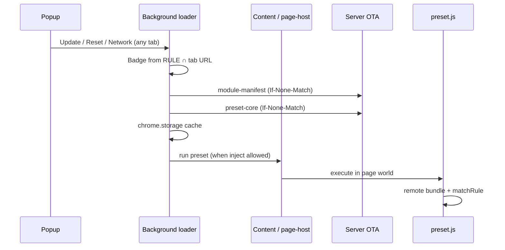

# MagickMonkey Chrome Extension — Product Review & TODO

> **Multi-service implementation:** see **[docs/multi-service-tasks.md](./docs/multi-service-tasks.md)** for architecture, storage keys, migration, and manual QA checklist (Phases 0–7).

## 0. Product positioning (confirmed)

| Principle                          | Decision                                                                                                                                                                                        |
| ---------------------------------- | ----------------------------------------------------------------------------------------------------------------------------------------------------------------------------------------------- |
| **Tampermonkey stays**             | `tampermonkey.user.js` remains for TM users — **separate code path**, no requirement to keep extension shell in sync with TM launcher **implementation**.                                       |
| **Extension = new loading shell**  | The extension is a **native Chrome loading shell** (background + popup + content bootstrap). It does **not** reuse, port, or mirror `launcherScript.ts` / the Tampermonkey userscript launcher. |
| **Shared server contracts only**   | Extension and TM both **consume** the same OTA artifacts (`module-manifest.json`, `preset.js`, `tampermonkey-remote.js`) and HTTP APIs. That is the only intentional overlap.                   |
| **Web owns script content**        | Publish via MagickMonkey editor → Gist. Extension never edits scripts.                                                                                                                          |
| **Extension owns chrome + policy** | Popup (fixed menu), badge (match count), RULE, per-script enable, cache/update — all **extension-native**.                                                                                      |

```text
                    MagickMonkey Web ──publish──► Gist + /static/*
                                    │
                    ┌───────────────┴───────────────┐
                    │     Server OTA contracts       │
                    │  manifest · preset · remote    │
                    └───────────────┬───────────────┘
                                    │
              ┌─────────────────────┴─────────────────────┐
              ▼                                           ▼
   ┌─────────────────────┐                 ┌─────────────────────────┐
   │ Tampermonkey path    │                 │ Extension path (NEW)     │
   │ tampermonkey.user.js │                 │ MV3 shell — own loader   │
   │ (GM + launcher IIFE) │                 │ background · popup · CS  │
   └──────────┬──────────┘                 └────────────┬────────────┘
              │                                         │
              └──────────────► preset.js ◄────────────────┘
                               script-bundle
```

**Do not conflate the two shells.** TM launcher is a userscript; extension shell is a browser extension product.

---

## 1. Two shells, one server

|                     | Tampermonkey launcher                      | Extension shell (target)                                   |
| ------------------- | ------------------------------------------ | ---------------------------------------------------------- |
| **What it is**      | Generated `.user.js` (`launcherScript.ts`) | CRX: service worker + popup + content scripts              |
| **Loader code**     | Stays in `services/tampermonkey/`          | Lives in `extension/src/` only — **new design**            |
| **Shell UI**        | TM browser menu + in-page GM menus         | **Popup** (fixed on every tab) + badge                     |
| **Storage**         | `GM_setValue`                              | `chrome.storage.local` (+ optional page bridge for preset) |
| **Network**         | `GM_xmlhttpRequest`                        | `fetch` in background / extension context                  |
| **Update / editor** | Userscript + preset menus                  | **Popup defaults** (§3.1)                                  |
| **OTA targets**     | Same manifest / preset / remote URLs       | Same URLs                                                  |

### 1.1 What we share with TM (contracts, not code)

| Shared                                                                      | Not shared                                 |
| --------------------------------------------------------------------------- | ------------------------------------------ |
| `GET /static/[key]/module-manifest.json`                                    | Launcher IIFE / `createLauncherScript`     |
| `GET …/preset.js`, `preset-ui.js`, `tampermonkey-remote.js`                 | `GM_registerMenuCommand` as shell UI       |
| ETag / hash semantics, cache **key names** (`shared/launcher-constants.ts`) | `new Function` + `@grant` injection model  |
| `GET /api/tampermonkey/[key]/rule`                                          | Porting `launcherScript.ts` into extension |
| OTA `preset.js` → `GME_*` on page                                           | Extension re-implementing `GME_*`          |

### 1.2 Interim vs target (current repo)

|                                          | Status                                     | Action                                                                          |
| ---------------------------------------- | ------------------------------------------ | ------------------------------------------------------------------------------- |
| `extension/src/page/launcher-runtime.ts` | **Interim** — copied from TM launcher flow | **Replace** with extension-native loader (E25–E27)                              |
| `extension/src/page/gm-bridge.ts`        | Interim GM shim for preset in page world   | Keep until preset runs in page; evolve toward background fetch + minimal inject |
| `extension/src/shell/`                   | **Missing**                                | **Primary work** — real product shell                                           |

---

## 2. Extension-native shell architecture

The extension shell is three cooperating parts. None of them are “the Tampermonkey launcher inside the extension.”

```text
extension/src/
├── shell/
│   ├── background.ts      ← Loader orchestration, cache, badge, tab messages
│   └── popup/             ← Fixed shell menu (§3.1) — compact; links out to full pages
├── pages/
│   ├── options/           ← Connection config (baseUrl, scriptKey) + RULE editor
│   └── scripts/           ← Script enable/disable (§3.7) — full tab page
├── runtime/
│   ├── content.ts         ← Thin: inject / message relay (isolated world)
│   ├── page-host.ts       ← Page world: run OTA preset + expose GM_* for Gist
│   ├── module-loader.ts   ← NEW: manifest → preset fetch (extension-native)
│   └── gm-compat.ts       ← GM_* surface preset expects (not TM grants copy)
```

_(Interim code may still live under `src/page/` and `src/options/` until E24 restructure.)_

### 2.1 Responsibility split

| Component               | Owns                                                                                                                                                              |
| ----------------------- | ----------------------------------------------------------------------------------------------------------------------------------------------------------------- |
| **Background**          | Module manifest fetch; preset/remote cache in `chrome.storage`; badge; popup actions (update, reset, open editor tab); RULE match count; broadcast reload to tabs |
| **Popup**               | Fixed **compact** menu on every URL; links to full pages; commands to background                                                                                  |
| **Scripts page**        | Per-script **enable/disable** (global list); search; optional “edit on web” links                                                                                 |
| **Options page**        | Connection config + **RULE** editor                                                                                                                               |
| **Content + page-host** | Inject preset when policy allows; run downloaded preset text; `GM_*` compat so OTA preset + Gist scripts work                                                     |
| **Server OTA**          | preset-core, preset-ui, script-bundle content                                                                                                                     |

### 2.2 Loader behavior (extension-native, server-aligned)

Extension loader **implements the same outcomes** as today’s runtime (cache-first, hash check, rollback) but **with Chrome APIs**:

1. Read `baseUrl` + `scriptKey` from extension config.
2. Background (or delegated fetch): `module-manifest.json` → resolve `preset-core` URL + hash.
3. Conditional GET preset body; persist in `chrome.storage` under scoped keys from `shared/launcher-constants.ts`.
4. Message content script: execute preset in page world with injected globals (`__BASE_URL__`, `__SCRIPT_URL__`, …).
5. Preset `main` loads remote bundle as today.

**Not required:** string-generate a userscript, `@grant`, Tampermonkey `new Function` parameter list, or call into `launcherScript.ts`.

### 2.3 Shell actions are extension defaults

These belong in **popup / background**, not in userscript or preset menus:

- Open editor (`${baseUrl}/editor`)
- Update runtime (clear module cache, refetch manifest + preset, reload tab)
- Reset runtime state (clear `vws_*` keys, keep config)
- Network on/off (`vws_shell_network_enabled`)

**Not in popup (use dedicated pages):**

- Per-script enable toggles → **Scripts page** (`scripts.html`, §3.7)
- RULE editing → **Options page**

TM users may still use preset/TM menus; extension users use **popup + extension pages**.

---

## 3. Shell UX specification

### 3.1 Popup — fixed compact menu (independent of RULE / match)

Opens on **any tab**, **any URL**. **Same sections always** — no hiding blocks when match count is 0. Keep the popup **small**; heavy lists live on **extension pages** (new tab), not inside the dropdown.

| Section       | Items                                                                                                    |
| ------------- | -------------------------------------------------------------------------------------------------------- |
| Header        | Logo, `baseUrl`, link to **Options**                                                                     |
| Shell actions | Open editor · Update runtime · Reload active tab · Reset runtime state                                   |
| Network       | Shell network toggle                                                                                     |
| Navigation    | **Manage scripts** → opens `scripts.html` in a tab · **Manage rules** → Options (RULE section or anchor) |
| Footer        | Extension version · optional “N scripts match this tab” (read-only) · cached module hashes               |

**Not in popup:** per-script toggle rows, RULE tables, script search — those belong on **`scripts.html`** / Options.

Disabled + tooltip when an action needs a normal web tab (e.g. reload).

### 3.7 Scripts page — script enable/disable (recommended)

**Yes — use a dedicated extension page** (`scripts.html`) opened in a **new tab**, not the popup. This fits MV3 well (same pattern as Options) and scales when there are many Gist modules.

|                    | Popup                            | Scripts page                                               |
| ------------------ | -------------------------------- | ---------------------------------------------------------- |
| Purpose            | Quick shell actions + navigation | Manage which scripts are **enabled**                       |
| Size               | ~360px wide dropdown             | Full tab — list, search, filters                           |
| Content vs match   | Fixed                            | Fixed global list (not URL-filtered)                       |
| Edit script source | No — link out                    | **Edit on web** → `${baseUrl}/editor` (optional deep link) |

**Suggested UI (`extension/src/pages/scripts/`):**

| Element         | Behavior                                                                                          |
| --------------- | ------------------------------------------------------------------------------------------------- |
| Script list     | All known script ids (from RULE `script` names + server index / manifest metadata when available) |
| Enable toggle   | Writes `vws_script_enabled:<name>` in `chrome.storage`                                            |
| Search / filter | By filename; optional “enabled only”                                                              |
| Row actions     | Open in web editor (new tab); optional last-run status if background tracks it                    |
| Header actions  | Enable all / disable all (optional); refresh list from server                                     |

**Open from popup:** `chrome.tabs.create({ url: chrome.runtime.getURL('scripts.html') })`.

**Manifest:** list `scripts.html` in `web_accessible_resources` only if a content script must link to it; for popup/background navigation, packaging in `dist/` is enough.

**Storage contract unchanged:** toggles still use `vws_script_enabled:<name>`; preset/runtime reads the same keys (E11). Changing a toggle should optionally notify background to **reload affected tabs** or wait until next navigation.

**Why not Options?** Options stays focused on **connection + RULE**. Script on/off is **runtime policy** users may change often — a dedicated **Scripts** page keeps Options stable and gives toggles room to grow (status, bulk actions) without bloating the popup.

### 3.2 Badge — match count only

- `chrome.action` badge = number of **enabled** RULE entries matching **active tab URL**.
- Empty when 0 or unconfigured.
- **Does not change popup content.**

Counting uses same wildcard semantics as `preset/src/rules.ts` (`matchUrl`); implement once in extension (shared util or small copy), not via TM.

### 3.3 RULE — injection + badge + `matchRule`, not popup

| RULE affects                           | Popup                                                |
| -------------------------------------- | ---------------------------------------------------- |
| Inject runtime on tab (when match > 0) | Unchanged                                            |
| Badge number                           | Unchanged                                            |
| `matchRule` in page                    | Script enable flags (global, edited on Scripts page) |

Web publishes rules; extension stores local RULE in Options + optional API sync. **Script toggles are not edited in popup or Options** — use **Scripts page** (§3.7).

### 3.4 Runtime state (`chrome.storage`)

| Key                         | Purpose                                                                               |
| --------------------------- | ------------------------------------------------------------------------------------- | ---------------- |
| `vws_extension_config`      | `baseUrl`, `scriptKey`, `developMode`                                                 |
| `vws_shell_network_enabled` | OTA network                                                                           |
| `vws_script_enabled:<name>` | Global script switch                                                                  | **Scripts page** |
| `vws_*` cache keys          | From `shared/launcher-constants.ts` — preset expects these names when bridged to page |

### 3.5 Page APIs (`GM_*` / `GME_*`)

| API     | Provider                                                                                                                                                                             |
| ------- | ------------------------------------------------------------------------------------------------------------------------------------------------------------------------------------ |
| `GME_*` | Always from OTA **`preset.js`** — never implemented in extension CRX                                                                                                                 |
| `GM_*`  | Extension **`gm-compat.ts`** in page world — must satisfy **preset + Gist** call sites (reference: `grant.ts` + `editor-typings.d.ts`), not “be identical to Tampermonkey internals” |

Shell popup/background **does not** implement `GME_*` or use `GM_registerMenuCommand` for product UI.

### 3.6 Non-goals

- Reusing or syncing extension loader with `launcherScript.ts`
- Tampermonkey-style variable dropdown
- In-extension script editor
- Popup layout tied to match rules
- Removing TM path

---

## 4. Load & update flow (extension-native)



**OTA triggers:** hash change, popup Update, dev SSE (optional bridge to background), storage channel equivalent to `PRESET_UPDATE_CHANNEL_KEY`.

---

## 5. Current implementation snapshot (2026-06-27)

| Area                                                         | Status                        |
| ------------------------------------------------------------ | ----------------------------- |
| Extension shell (background + popup + admin)                 | **DONE**                      |
| Badge, RULE, Scripts/Servers/Logs/Permissions tabs           | **DONE**                      |
| `GM_*` compat (XHR → background fetch)                       | **DONE**                      |
| Interim `launcher-runtime.ts` (page-world OTA orchestration) | Present — **backlog** E25–E27 |
| TM launcher                                                  | Independent path              |

详见 `.ai/tasks/backlog/extension-native-loader.md`。

---

## 6. Delivery tiers

### Tier 1 — Native shell product

- Background + popup + badge
- Extension-native loader (manifest → preset cache → inject)
- Remove dependency on TM launcher **code** (E27)
- Popup shell actions wired to background

### Tier 2 — Policy

- RULE in Options; badge + inject gating
- **Scripts page** for enable/disable (not popup)
- Sync rules from server API

### Tier 3 — Hardening

- Full `GM_*` compat for Gist scripts on page (E17)
- E2E: popup identical on matched / unmatched / `chrome://` tabs
- E2E: OTA update via popup without extension rebuild

---

## 7. Task backlog

Status: `TODO` | `IN_PROGRESS` | `DONE` | `BLOCKED`

### P0 — Extension-native shell (not TM launcher)

| ID  | Task                                                                                     | Status | Notes                       |
| --- | ---------------------------------------------------------------------------------------- | ------ | --------------------------- |
| E20 | `shell/background.ts` + manifest service worker                                          | TODO   | Loader home; badge          |
| E21 | `shell/popup/` + `default_popup`                                                         | TODO   | Fixed menu §3.1             |
| E22 | Popup → background: editor, update, reset, network                                       | TODO   | Product defaults            |
| E23 | Badge: RULE match count per tab                                                          | TODO   | Independent of popup layout |
| E25 | **`runtime/module-loader.ts`** — manifest/preset fetch via background + `chrome.storage` | TODO   | **New code**, not TM port   |
| E26 | Wire content/page-host to background loader (messages, not launcher IIFE)                | TODO   |                             |
| E27 | **Remove / retire `launcher-runtime.ts` TM port** after E25–E26                          | TODO   | Delete duplication          |
| E24 | Restructure folders: `shell/` + `runtime/`                                               | TODO   |                             |
| E2  | OTA via popup Update (no CRX rebuild)                                                    | TODO   |                             |
| E4  | README + TODO: extension shell ≠ TM launcher                                             | TODO   |                             |

**Cancelled / replaced:** ~~E1 Extract shared launcher-runtime with TM~~ — extension loader is **independent**; only share constants + URL contracts.

### P1 — RULE + scripts

| ID  | Task                                                                | Status | Notes               |
| --- | ------------------------------------------------------------------- | ------ | ------------------- |
| E5  | `ExtensionRuleEntry` schema                                         | TODO   |                     |
| E6  | Options RULE CRUD                                                   | TODO   |                     |
| E7  | Inject only when match count > 0                                    | TODO   | Popup still opens   |
| E8  | Inject `setGlobalRules` / matchRule data into page                  | TODO   |                     |
| E9  | Sync rules from server                                              | TODO   |                     |
| E10 | Per-script `enabled` flags + Scripts page UI                        | TODO   | §3.7; not in popup  |
| E28 | Add `pages/scripts/` + `scripts.html` + popup “Manage scripts” link | TODO   | Opens in new tab    |
| E11 | Preset hook for extension enabled flags                             | TODO   | Small preset change |

### P2 — Page compat + quality

| ID  | Task                                                | Status | Notes                             |
| --- | --------------------------------------------------- | ------ | --------------------------------- |
| E16 | Audit Gist/preset `GM_*` usage vs `gm-compat.ts`    | TODO   | Not “match TM launcher”           |
| E17 | Implement missing `GM_*` for page scripts           | TODO   |                                   |
| E18 | Same Gist script: TM path vs extension page runtime | TODO   | Compare behavior, not loader code |
| E13 | Editor link with config query params                | TODO   |                                   |
| E14 | E2E: popup identical everywhere                     | TODO   |                                   |

### Parallel (decoupled from extension shell)

| ID         | Task                                         | Owner                                                                      |
| ---------- | -------------------------------------------- | -------------------------------------------------------------------------- |
| TM-\*      | Maintain `tampermonkey.user.js` for TM users | `services/tampermonkey/`                                                   |
| R-C*, R-D* | Server-side modular runtime                  | `.ai/tasks/done/runtime-modularization-phase-a-b-c.md` (Phase D → backlog) |

---

## 8. Definition of done

### v1 — Extension-native shell

- [ ] No runtime dependency on `launcherScript.ts` or TM launcher IIFE in extension
- [ ] Background loads OTA modules; popup controls update/editor/reset/network
- [ ] Popup identical on every tab; badge = match count only
- [ ] Web-only script publish; extension consumes OTA
- [ ] TM path still works independently for TM users

### v2 — Policy + page runtime

- [ ] RULE in Options; badge + inject use same rule set
- [ ] **Scripts page** lists all scripts + enable toggles (popup only links to it)
- [ ] `GM_*` sufficient for OTA preset + Gist on matched pages
- [ ] `GME_*` only from server `preset.js`

---

## 9. References

| Topic                   | Location                                                | Extension relationship          |
| ----------------------- | ------------------------------------------------------- | ------------------------------- |
| TM launcher (TM only)   | `services/tampermonkey/launcherScript.ts`               | **Do not port** — parallel path |
| Interim loader (remove) | `extension/src/page/launcher-runtime.ts`                | Replace with E25                |
| Server manifest         | `services/runtime/moduleManifest.ts`                    | **Consume**                     |
| Cache key names         | `shared/launcher-constants.ts`                          | **Share** (storage compat)      |
| Match helpers           | `preset/src/rules.ts`                                   | Reuse logic, not TM shell       |
| GM surface for Gist     | `services/tampermonkey/grant.ts`, `editor-typings.d.ts` | **Compat target** for page      |
| GME registration        | `preset/src/services/global-registry.ts`                | Via OTA preset only             |

---

_Aligned with: extension is a **new native loading shell**; Tampermonkey launcher code is not the extension foundation; server OTA contracts are shared; popup stays compact; **Scripts page** carries enable/disable; script edits stay on web._
